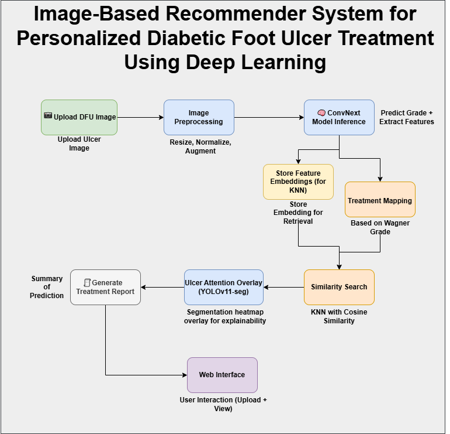

# 🩺 AI-Based Diabetic Patient Management (ADPM)
## Image Based Recommender System for Personalized Diabetic Foot Ulcer Treatment Using Deep Learning
An end-to-end system for automated **Diabetic Foot Ulcer (DFU)** grade classification, treatment recommendation, explainability, and report generation — integrated with a mobile app and powered by deep learning and Supabase.
## Team Members:
* Haris Kabir 
* Khalid Khurhsid Siddiqui 
* Abdullah Shaikh 
---

## 📌 System Overview

This project enables users to upload DFU images via a mobile app, which are then processed through a series of AI and retrieval pipelines to generate a treatment report based on the ulcer grade and visual similarity to past cases.

---

## 🧠 Workflow Description

### 1. 📲 Upload DFU Image
- Users capture and upload DFU images through the **ADPM mobile app**.
- Images are uploaded to **Supabase Storage**, and a URL is generated for downstream tasks.

### 2. 🖼️ Image Preprocessing
- Images undergo resizing, normalization, and augmentation to prepare for model inference.

### 3. 🧠 Model Inference with ConvNext
- The preprocessed image is passed through a **ConvNext** model to:
  - Predict the **Wagner grade** of the ulcer.
  - Extract **feature embeddings** for KNN-based retrieval.

### 4. 🔁 Parallel Processing
- **Store Feature Embeddings** for retrieval using KNN with cosine similarity.
- **Map Recommended Treatment** based on the predicted grade.

### 5. 🔍 Similarity Search
- A **K-Nearest Neighbors (KNN)** search is performed using cosine similarity to retrieve visually and contextually similar past DFU cases.

### 6. 🔥 Explainability with Segmentation Overlay
- A segmentation heatmap is generated using **YOLOv11-seg** to highlight the ulcer area, providing model explainability.

### 7. 📝 Treatment Report Generation
- A PDF report is compiled with:
  - Predicted ulcer grade
  - Similar case references
  - Segmentation overlay
  - Recommended treatments

### 8. ☁️ Report Storage and Delivery
- The report is uploaded to **Supabase**.
- A download link is sent to the user via the mobile app.

---

## 🛠️ Tech Stack

| Component         | Technology           |
|------------------|----------------------|
| Frontend         | React                |
| Backend          | Python, FastAPI      |
| Image Storage    | Supabase Storage     |
| Classification   | ConvNext(2022)       |
| Segmentation     | YOLOv11-seg(2024)    |
| Similarity Search| KNN + Cosine Similarity |
| Database         | Supabase (PostgreSQL)|
| Reporting        | PDF Generator (e.g. ReportLab) |

## Setup and Run Guidelines
### Step 1: Create a new virtual environment named 'venv'
python -m venv venv

### Step 2: Activate the environment
 On Windows:
 venv\Scripts\activate

### Step 3: Upgrade pip and install common packages
pip install --upgrade pip
pip install fastapi uvicorn torch torchvision timm pillow ultralytics python-multipart scikit-learn fpdf python-multipart numpy pandas matplotlib jupyter reportlab

pip install torchcam
pip install pdf2image
### Step 4: Freeze dependencies
pip freeze > requirements.txt

### Step 5: Print VS Code instructions
echo "✅ Virtual environment 'venv' created."
echo "👉 Open Command Palette in VS Code (Ctrl+Shift+P), then run: Python: Select Interpreter"
echo "👉 Choose the one from './venv' folder"

## How to run
uvicorn main:app --reload

## Test using this
Endpoint: POST http://127.0.0.1:8000/docs/

## 📄 License

This project is licensed under the MIT License.

---

## 🤝 Contributions

Contributions, issues, and feature requests are welcome!  
You can fix the repo and submit a pull request.

